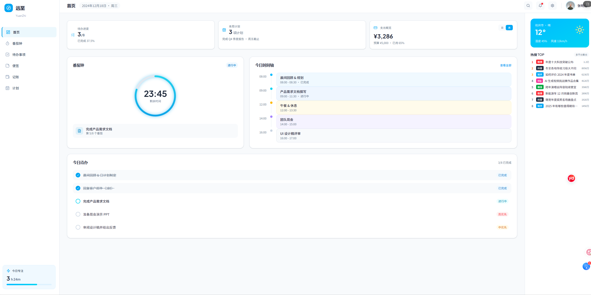

# 远至（YuanZhi）

远至是一款面向个人使用的日程与专注管理应用，将待办事项、周期计划、番茄钟、天气和热点信息集中在同一个工作台中。项目采用前后端分离架构，默认使用本地 SQLite 数据库存储数据，适合本地运行和二次开发。



> 🤖 **AI 开发者请先阅读 [AGENTS.md](./AGENTS.md)**——项目全貌、技术栈、开发约定、已知问题与路线图都在里面。

## 功能特性

- **概览工作台**：汇总当日任务、完成进度、专注时长和番茄数量。
- **待办管理**：创建、编辑、完成和删除待办，支持优先级、截止时间与番茄目标。
- **计划管理**：管理每日、每月和年度计划；每日计划支持按天、间隔天数或指定星期重复，并提供打卡热力图、连续全勤天数、本周完成率与往日未完成回顾；重复计划支持按天、跟随日期或整体系列地编辑与删除。
- **计划模板**：把某一天的计划保存为模板，一键生成任意日期的计划，自动跳过重复项。
- **计划总结**：坚持记录（今日完成、本周完成率、连续全勤、往日未完成补打卡）+ GitHub 式全年打卡热力图，可按年回顾。
- **记账**：快速记一笔（金额、分类、支付方式、备注、精确到时分的时间），支持收入与支出、记录编辑，自动汇总本月收支、分类占比与存款/负债（信用卡待还）。
- **提醒与执行**：首页时间轴按时间排序，高亮当前进行中的计划并标红过期未完成项；每日计划可在开始前 10 分钟桌面通知；计划支持一键转为待办。
- **数据安全**：设置面板支持一键导出/导入全部数据（JSON）；后端每次启动自动备份数据库到 `backend/backups/`（保留最近 7 份）；番茄钟计时基于墙钟时间，刷新页面后自动恢复。
- **番茄钟**：自定义专注时长、关联待办，支持手动补录；最近 7 天专注记录可编辑、删除，计时完成有桌面通知。
- **天气信息**：通过和风天气（QWeather）获取实时天气及七日预报。
- **聚合热搜**：展示微博、抖音、知乎、哔哩哔哩、百度和今日头条热点。
- **响应式界面**：适配桌面端和移动端显示。

## 技术栈

| 层级 | 技术 |
| --- | --- |
| 前端 | React 18、TypeScript、Vite 6、Lucide React |
| 后端 | Python、FastAPI、SQLAlchemy 2、Pydantic 2 |
| 数据库 | SQLite（默认） |
| 测试 | Pytest、FastAPI TestClient、TypeScript Compiler |
| 代码质量 | ESLint（react-hooks / react-refresh 规则）、GitHub Actions CI |

## 项目结构

```text
yuanzhi/
├── frontend/                 # 当前 React 前端
│   ├── src/
│   │   ├── pages/            # 首页、待办、番茄钟、计划页面
│   │   ├── components/       # 侧边栏、顶栏与各弹窗组件
│   │   ├── api.ts            # API 客户端与类型定义
│   │   ├── utils.ts          # 通用工具函数
│   │   └── styles.css        # 全局样式
│   ├── eslint.config.js      # ESLint 配置
│   ├── package.json          # 前端依赖与脚本
│   └── vite.config.ts        # 开发服务器与 API 代理
├── backend/                  # 当前 FastAPI 后端
│   ├── app/
│   │   ├── routers/          # 按资源拆分的接口层
│   │   ├── models.py         # SQLAlchemy 模型
│   │   ├── schemas.py        # Pydantic Schema
│   │   ├── migrations.py     # 版本化数据库迁移
│   │   └── main.py           # 应用入口与启动逻辑
│   ├── tests/                # 后端自动化测试
│   ├── requirements.txt      # 运行时依赖
│   └── requirements-dev.txt  # 开发与测试依赖
├── .github/workflows/        # GitHub Actions CI
├── legacy/                   # 早期静态原型，仅作历史参考
├── new_home.png              # 项目预览图
└── README.md
```

`legacy/` 目录中的 `index.html`、`app.js`、`app.css`、`home.html`、`todos.html`、`pomodoro.html`、`manifest.webmanifest` 和 `service-worker.js` 属于早期静态原型，仅作历史参考，不参与当前应用的构建或部署。

## 环境要求

- Python 3.10 或更高版本
- Node.js 18 或更高版本
- npm 9 或更高版本

## 快速开始

### 1. 启动后端

在项目根目录执行：

```powershell
cd backend
python -m venv .venv
.\.venv\Scripts\python.exe -m pip install -r requirements.txt
.\.venv\Scripts\python.exe -m uvicorn app.main:app --reload --host 127.0.0.1 --port 8011
```

macOS 或 Linux：

```bash
cd backend
python3 -m venv .venv
./.venv/bin/python -m pip install -r requirements.txt
./.venv/bin/python -m uvicorn app.main:app --reload --host 127.0.0.1 --port 8011
```

后端启动后可访问：

- 健康检查：<http://127.0.0.1:8011/api/health>
- Swagger UI：<http://127.0.0.1:8011/docs>
- OpenAPI 描述：<http://127.0.0.1:8011/openapi.json>

### 2. 启动前端

另开一个终端，在项目根目录执行：

```powershell
cd frontend
npm ci
npm run dev
```

浏览器打开 <http://127.0.0.1:5173>。Vite 开发服务器会将 `/api` 请求代理到 `http://127.0.0.1:8011`。

首次启动后端时会自动创建数据表、执行数据库迁移并写入示例待办。默认数据库文件位于 `backend/yuanzhi.db`。

## 配置说明

### 数据库

后端通过 `YUANZHI_DATABASE_URL` 读取数据库连接地址，未设置时使用 `sqlite:///./yuanzhi.db`。

PowerShell 示例：

```powershell
$env:YUANZHI_DATABASE_URL = "sqlite:///./data/yuanzhi.db"
```

Bash 示例：

```bash
export YUANZHI_DATABASE_URL="sqlite:///./data/yuanzhi.db"
```

相对路径以启动后端时的工作目录为基准。修改连接地址后再启动服务即可生效。

### 天气与热搜

进入应用右上角的设置面板可配置以下内容：

| 配置项 | 说明 | 是否必需 |
| --- | --- | --- |
| 天气 API 地址 | 和风天气提供的 HTTPS API Host | 使用天气功能时必需 |
| 天气 API Key | 和风天气项目凭证 | 使用天气功能时必需 |
| 默认城市 | 城市名称，例如“北京” | 使用天气功能时必需 |
| 热搜 API 地址 | 固定为 `https://uphotspot.com/api/all` | 否，已有默认值 |
| 热搜 API Key | 热搜服务凭证 | 取决于服务端要求 |

API Key 会保存在本地数据库中，查询设置时不会返回明文，但当前版本未对数据库内的值进行加密。请勿在共享或不受信任的运行环境中填写高权限凭证。

## API 概览

所有业务接口均以 `/api` 为前缀。

| 方法 | 路径 | 说明 |
| --- | --- | --- |
| `GET` | `/api/health` | 服务健康检查 |
| `GET` / `POST` | `/api/todos` | 查询或创建待办 |
| `PATCH` / `DELETE` | `/api/todos/{todo_id}` | 更新或删除待办 |
| `POST` | `/api/pomodoros` | 记录一次专注 |
| `GET` | `/api/dashboard` | 获取当日统计 |
| `GET` / `POST` | `/api/plans` | 查询或创建计划 |
| `GET` | `/api/plans/stats` | 计划打卡统计：今日完成、本周完成率、连续全勤天数、往日未完成 |
| `GET` | `/api/plans/checkins` | 按月（`month=YYYY-MM`）或按年（`year=YYYY`）返回每日打卡明细 |
| `PATCH` / `DELETE` | `/api/plans/{plan_id}` | 更新或删除计划，可选 `scope=one/series/following` 控制作用范围（默认仅当天） |
| `GET` / `POST` | `/api/plan-templates` | 查询模板；传入 `name` 和 `date` 可把该日计划存为模板 |
| `POST` | `/api/plan-templates/{id}/apply` | 把模板生成为指定日期的每日计划 |
| `DELETE` | `/api/plan-templates/{id}` | 删除模板 |
| `GET` / `POST` | `/api/expenses` | 按月查询消费记录（含汇总）或新增一笔 |
| `DELETE` | `/api/expenses/{expense_id}` | 删除消费记录 |
| `GET` | `/api/weather` | 获取天气与预报 |
| `GET` | `/api/trending` | 获取聚合热搜 |
| `GET` / `PUT` | `/api/settings` | 查询或更新应用设置 |

完整的请求参数和响应结构以运行时的 Swagger UI 为准。

## 开发与验证

后端测试：

```powershell
cd backend
.\.venv\Scripts\python.exe -m pip install -r requirements-dev.txt
.\.venv\Scripts\python.exe -m pytest
```

前端类型检查、代码检查、测试与生产构建：

```powershell
cd frontend
npm run lint
npm run check
npm test
npm run build
```

生产构建产物输出到 `frontend/dist/`。构建后直接启动后端即可获得一体化服务：FastAPI 检测到 `frontend/dist` 存在时会自动托管前端，访问 <http://127.0.0.1:8011/> 使用完整应用；也可以继续用静态文件服务器托管该目录，并通过同源反向代理将 `/api` 转发到 FastAPI 服务。

## 手机与其他设备访问

应用已内置 PWA 支持（manifest + Service Worker），手机和 MacBook 通过浏览器即可使用，并可"添加到主屏幕"像原生应用一样打开。

**方式一：局域网直连（最简单）**

1. 启动后端时把监听地址改为 `0.0.0.0`，允许其他设备访问：

```powershell
cd backend
.\.venv\Scripts\python.exe -m uvicorn app.main:app --host 0.0.0.0 --port 8011
```

2. 手机连接同一个 Wi-Fi，浏览器打开 `http://<电脑局域网IP>:8011`（Windows 用 `ipconfig` 查看 IPv4 地址；首次访问需在 Windows 防火墙放行 8011 端口）。

局域网 HTTP 下全部功能可用，但浏览器限制下无法安装 PWA 和离线缓存。

**局域网访问建议开启访问令牌**：启动前设置环境变量 `YUANZHI_API_TOKEN`（值为自定义的随机字符串），所有 /api 接口将要求携带该令牌；首次打开页面时会弹窗询问一次，输入后保存在浏览器本地。未设置该变量时不启用校验。

```powershell
$env:YUANZHI_API_TOKEN = "一串只有你知道的随机字符串"
.\.venv\Scripts\python.exe -m uvicorn app.main:app --host 0.0.0.0 --port 8011
```

**方式二：Tailscale + HTTPS（推荐，完整 PWA 体验）**

PWA 的安装与 Service Worker 离线能力要求 HTTPS。使用 [Tailscale](https://tailscale.com/)（免费）可在不暴露公网的情况下获得有效证书：

1. 电脑和手机都安装 Tailscale 并登录同一账号。
2. 电脑上执行 `tailscale serve 8011`，会得到一个 `https://<机器名>.<网络名>.ts.net` 地址。
3. 手机浏览器打开该地址，即可"添加到主屏幕"安装完整 PWA（MacBook 也用同样方式访问）。

**离线与缓存说明**：Service Worker 会对页面与静态资源做离线缓存（API 数据始终实时请求）。浏览器要求 HTTPS 或 localhost 才启用该能力，因此 `http://127.0.0.1:8011` 桌面访问和 Tailscale HTTPS 访问都支持离线回退；局域网 HTTP 访问时应用功能正常，但无离线能力。

## 数据与迁移

- 应用启动时自动创建缺失的数据表、执行版本化迁移，并在改动前把数据库备份到 `backend/backups/`（保留最近 7 份）。
- 设置面板提供“导出数据 / 导入数据”：导出为包含待办、计划、专注记录、计划模板、记账与设置的 JSON 备份；导入会用备份内容整体覆盖当前数据。
- 更新代码或迁移前，也建议手动备份一份 `backend/yuanzhi.db`。
- 测试使用独立的 `backend/tests/test.db`，不会读写正式数据库。

## 常见问题

**前端提示请求失败**

确认后端运行在 `127.0.0.1:8011`，并访问健康检查接口验证服务状态。若修改了后端端口，需要同步更新 `frontend/vite.config.ts` 中的代理地址。

**天气信息显示为空**

确认已在设置中填写有效的和风天气 API Host、API Key 和城市。无法连接第三方服务或凭证无效时，后端会返回空天气数据。

**热搜内容为空**

热搜依赖外部服务，网络不可用、接口限流或服务异常时可能暂无数据。成功结果会在后端缓存约 5 分钟。

**没有收到计划提醒**

需要在页面顶部的横幅中授权桌面通知（浏览器权限为“询问”时才会显示横幅），并保持页面处于打开状态；提醒在每日计划开始前 10 分钟内触发，已开始或已完成的计划不会提醒。
